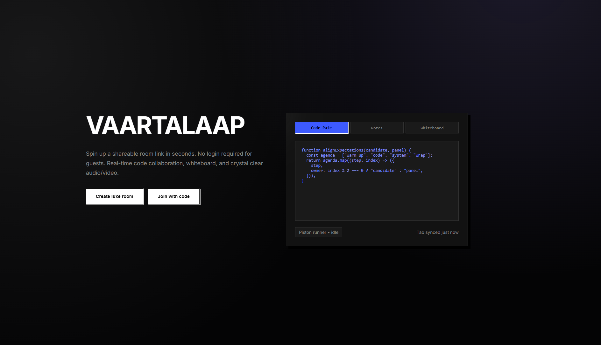
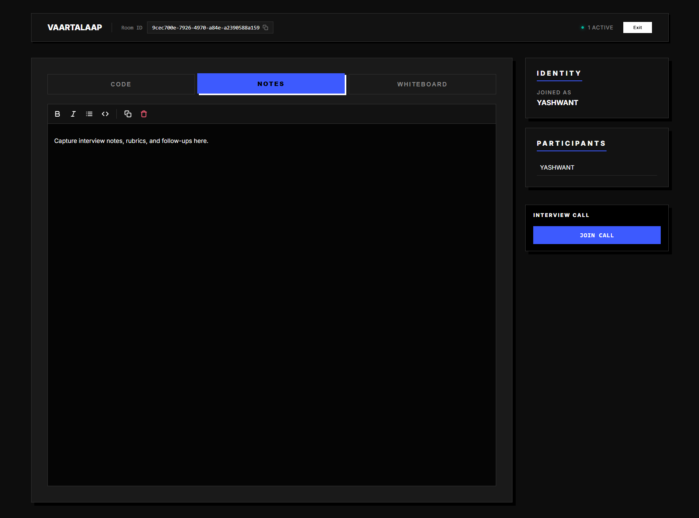
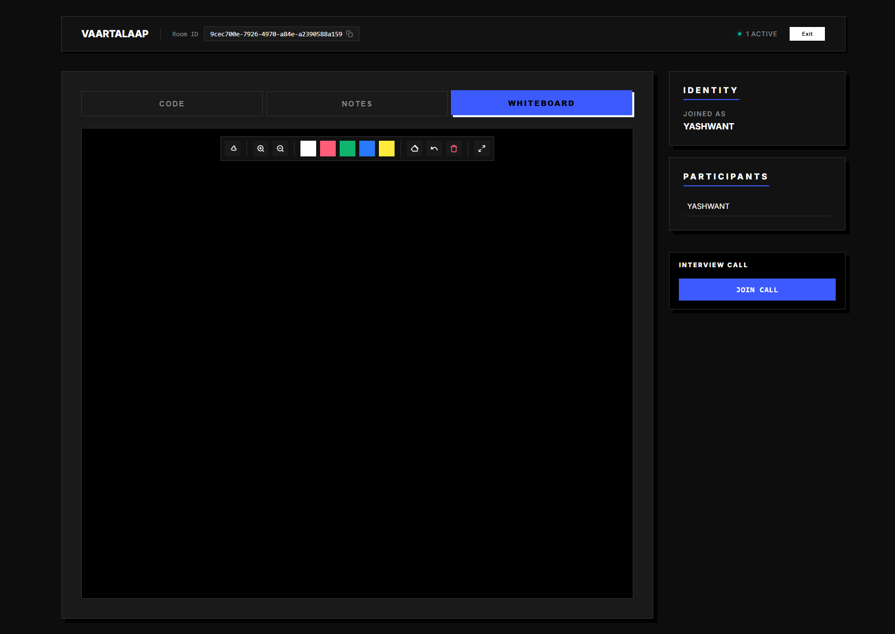

# VAARTALAAP

> **Spin up a shareable room link in seconds. No login required for guests. Real-time code collaboration, whiteboard, and crystal clear audio/video.**



---

## 💎 The Experience

Vaartalaap (Dialogue) is a bespoke interview portal designed for high-fidelity technical collaboration. It strips away the admin fuss and delivers a **NeoPop-infused**, dark-mode-first environment where code, ideas, and conversation flow seamlessly.

### ✨ Key Features

- **Zero-Friction Entry**: No sign-ups for guests. Just share a UUID link.
- **Real-Time Sync**: Every keystroke, stroke, and cursor movement is synchronized instantly via Socket.IO.
- **Polyglot Sandbox**: Run code in 15+ languages using the Piston execution engine.
- **Infinite Canvas**: A vector-based whiteboard for system design sketches.
- **Markdown Notes**: Collaborative notepad for rubrics and feedback.
- **Aesthetic UI**: Built with the CRED NeoPop design system for a tactile, premium feel.

---

## 📸 Visual Tour

### 1. The Code Pair
*Syntax highlighting, multi-cursor support, and instant execution.*


### 2. The Notes
*Markdown-enabled shared scratchpad for interviewers and candidates.*


### 3. The Whiteboard
*Vector drawing tools for architectural diagrams and flowcharts.*


---

## 🛠️ Tech Stack

**Monorepo Structure**
- **Client**: React, Vite, Styled Components, NeoPop, Framer Motion, Zustand.
- **Server**: Node.js, Express, Socket.IO, MongoDB.
- **Shared**: TypeScript types and utilities.

## 🚀 Getting Started

### Prerequisites
- Node.js 20+
- MongoDB (Local or Atlas)

### Installation

1. **Clone the repository**
   ```bash
   git clone https://github.com/iyashwantsaini/Vaartalaap.git
   cd Vaartalaap
   ```

2. **Install dependencies**
   ```bash
   npm install
   ```

3. **Configure Environment**
   Create a `.env` file in `apps/server` (see `.env.example`).

4. **Lift Off**
   ```bash
   npm run dev
   ```
   This spins up both the client (Vite) and server (Express) in parallel.

---

*Crafted with 🖤 by Yashwant Saini*
