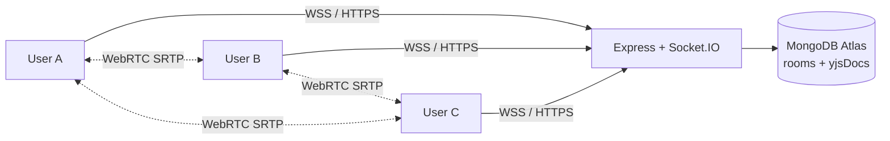

# Vaartalaap

Real-time collaboration rooms — collaborative code editor (CRDT), whiteboard, rich-text notes, mesh WebRTC video, chat. No accounts. Rooms expire after 30 days.

> *Vaartalaap (वार्तालाप)* — Hindi for *conversation*.

---

## At a glance


```mermaid
flowchart LR
  U1[User A] & U2[User B] & U3[User C] -- WSS / HTTPS --> Srv[Express + Socket.IO]
  Srv --> Mongo[(MongoDB Atlas<br/>rooms + yjsDocs)]
  U1 <-. WebRTC SRTP .-> U2
  U1 <-. WebRTC SRTP .-> U3
  U2 <-. WebRTC SRTP .-> U3
```

| Surface | Tech | Sync |
|---|---|---|
| Code editor | CodeMirror 6 + Yjs CRDT | y-codemirror.next + awareness cursors |
| Whiteboard | Canvas 2D | Socket.IO stroke broadcast |
| Notes | Tiptap rich-text | Socket.IO debounced doc:change |
| Chat | MUI list | Socket.IO append-only |
| Video / audio | WebRTC mesh (≤6) | Socket.IO signalling, Open Relay TURN |
| Theme | MUI v6 | localStorage + OS pref, dark/light toggle |

---

## Repo layout

```
Vaartalaap/
├── apps/
│   ├── client/                 React 18 + Vite 5 SPA
│   │   └── src/
│   │       ├── components/     CodeWorkbench, CollabCodeEditor, Whiteboard,
│   │       │                   Notepad, ChatPanel, CallPanel, ColorModeToggle…
│   │       ├── routes/         Landing, Room
│   │       ├── lib/            api, socket, yjs, codeExecutor, languages
│   │       └── styles/         muiTheme (factory), ColorModeProvider
│   └── server/                 Express 4 + Socket.IO 4
│       └── src/
│           ├── config/         env (Zod), db, socket
│           ├── routes/         roomRoutes
│           ├── services/       roomService, yjsService
│           └── lib/            logger
├── packages/shared/            Shared types (RoomSnapshot, Stroke, ChatMsg…)
└── docs/
    ├── ARCHITECTURE.md
    └── DEPLOYMENT.md
```

---

## Quick start

```bash
# 1. Install (npm workspaces — requires --legacy-peer-deps for Yjs/CodeMirror peer ranges)
npm install --legacy-peer-deps

# 2. Configure
cp apps/server/env.example apps/server/.env
cp apps/client/env.example apps/client/.env
# edit MONGODB_URI in apps/server/.env

# 3. Run both
npm run dev
# client → http://localhost:5173
# server → http://localhost:4000
```

Required env:
- **server**: `PORT`, `NODE_ENV`, `MONGODB_URI`, `CLIENT_ORIGIN`
- **client**: `VITE_API_BASE`

---

## Scripts

| Command | What it does |
|---|---|
| `npm run dev` | Concurrent client + server |
| `npm run dev:client` / `dev:server` | Run one only |
| `npm run build` | Build all workspaces |
| `npm run typecheck` | `tsc --noEmit` across workspaces |
| `npm run lint` | ESLint across workspaces |

---

## Highlights

- **Yjs CRDT** for the code editor — concurrent edits merge, cursors render with each peer's name + colour.
- **3-second grace period** on disconnect so a tab refresh doesn't drop you from the participant list.
- **Per-window identity** via `window.name` so two tabs in the same room never collide.
- **Theme-aware everything** — MUI palette, CodeMirror, whiteboard canvas, notes. Toggle in the AppBar.
- **Whiteboard auto-contrast** — strokes stay visible if a peer flips the theme.
- **3-tier code execution fallback** — Wandbox → CodeX → Agent.

---

## Docs

| File | What |
|---|---|
| [docs/ARCHITECTURE.md](docs/ARCHITECTURE.md) | System diagrams — topology, modules, lifecycles, data |
| [docs/DEPLOYMENT.md](docs/DEPLOYMENT.md) | Free-tier deploy on Vercel + Render + Atlas |
| [apps/client/README.md](apps/client/README.md) | Frontend internals |
| [apps/server/README.md](apps/server/README.md) | API + socket reference |

---

## License

Personal / educational use. Not affiliated with any of the third-party services referenced.
