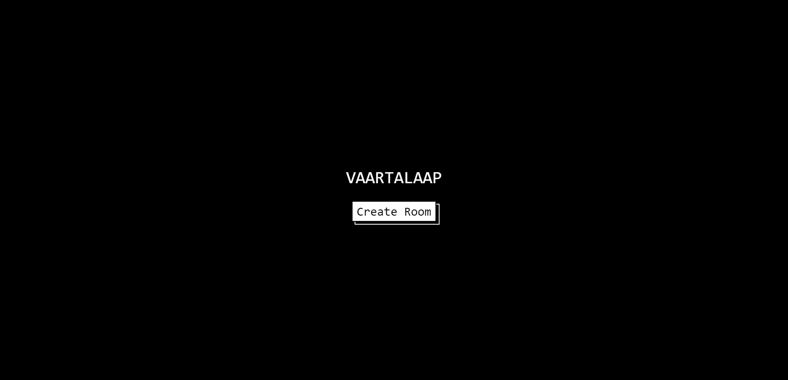
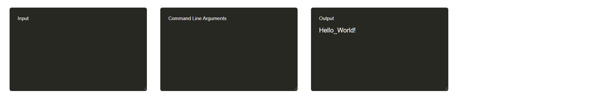

<h1 align="center">
  <br>
  <a href=""></a>
  <br>
    Vaartalaap
  <br>
</h1>

<h4 align="center">An Open Source Interview Plaform with Video Call Support (WebRTC) and a Realtime Collaborate Editor with Compiler (Piston)</h4>
<br />






## 🚀 Features

- A high-performance general-purpose code execution engine called Piston enabling users to compile and execute code in 61 programming languages including C, C++, Python and JavaScript.
- A Collaborative Text editor using Quill and solved the conflict while collaboration using Deltas and SocketIO.
- Used simple-peer and peerjs to create a Mesh Network of users in the same room allowing them to make video and audio calls.

## 🔥 Getting Started

#### Clone the repo

```
git clone https://github.com/meyash/Vaartalaap.git
```

#### Install NPM packages

```
npm install
```

#### Start the react server

```
npm start
```

## 🚀Technologies Used

- [React.js](https://reactjs.org/)
- [Node.js](https://nodejs.org/)
- [WebRTC](https://webrtc.org/)
- [PeerJS](https://peerjs.com/)
- [Socket.IO](https://socket.io/)
- [MongoDB](https://www.mongodb.com/)
- [CodeMirror](https://codemirror.net/)
- [Piston](https://github.com/engineer-man/piston)

## 📚 References

- https://codemirror.net/#features
- https://quilljs.com/
- https://webrtc.org/
- https://github.com/engineer-man/piston
- https://github.com/WebDevSimplified/google-docs-clone
- https://github.com/atharmohammad/Code-N-Collab
- https://github.com/Rishabh-malhotraa/caucus

## 📌 Contributors

<br />

<a href="https://meyash.xyz/" style="margin-right:30px;"></a>
<a href="https://meyash.xyz/resume.pdf" style="margin-right:30px;"></a>
<a href="https://www.linkedin.com/in/meyash21/" style="margin-right:30px;"></a>
<a href="https://twitter.com/meyash21" style="margin-right:30px;"></a>
<a href="https://www.instagram.com/meyash21/" style="margin-right:30px;"></a>
<a href="https://www.codechef.com/users/meyash21" style="margin-right:30px;"></a>
