# Vaartalaap — Architecture

Diagram-first reference. Text only where a diagram can't carry the meaning.

---

## 1. System topology

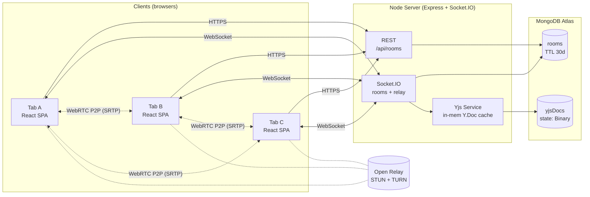

Key properties:
- **Server is a relay only for signalling, presence, Yjs ops, and CRUD snapshots.** Media never traverses it.
- **MongoDB holds two collections.** `rooms` = REST snapshots + presence-friendly metadata. `yjsDocs` = binary CRDT state per `(roomId, docName)`.
- **TURN** is Open Relay (free, public). STUN-only fallback used when TURN unreachable.

---

## 2. Monorepo layout

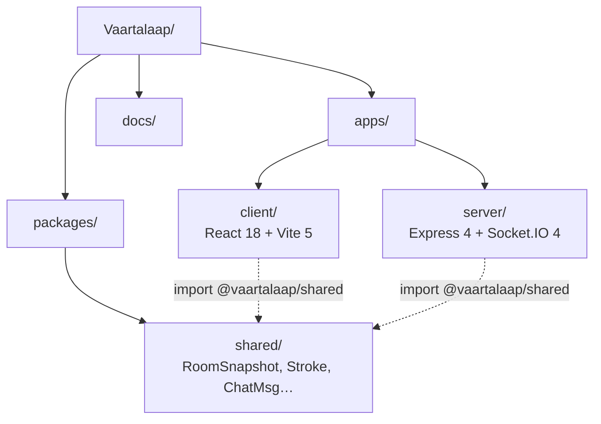

---

## 3. Frontend module map

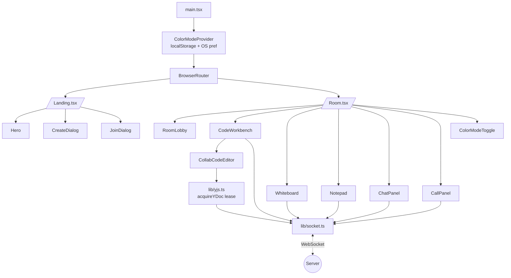

---

## 4. Server module map

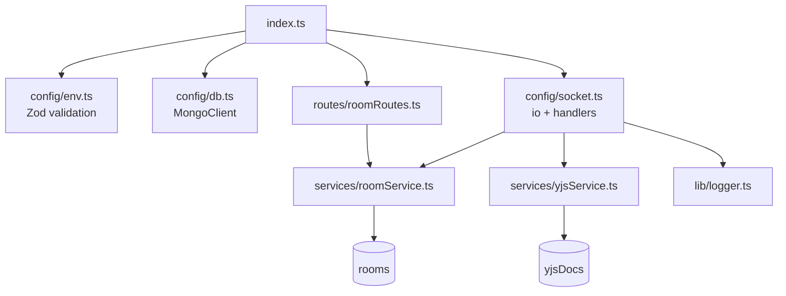

---

## 5. Room lifecycle

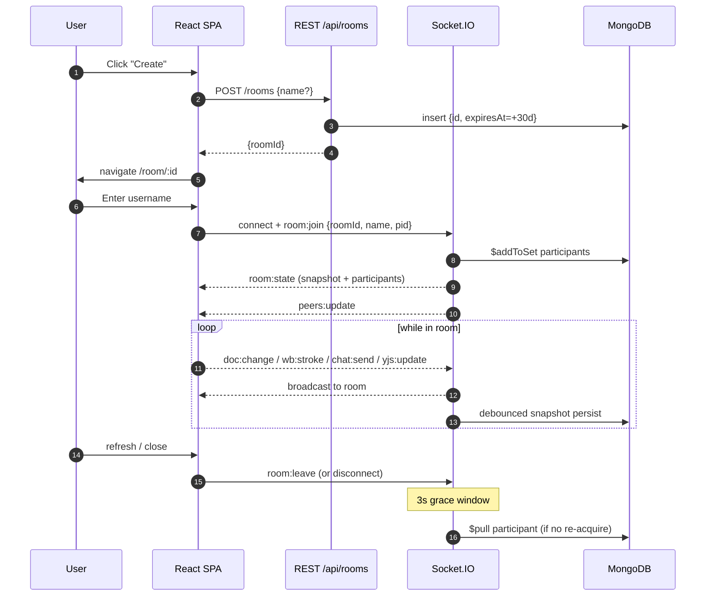

---

## 6. Per-socket session model

The server tracks two separate maps — per-socket memberships and a cross-socket refcount with a grace timer. This lets a tab refresh **not** flicker the participant list.

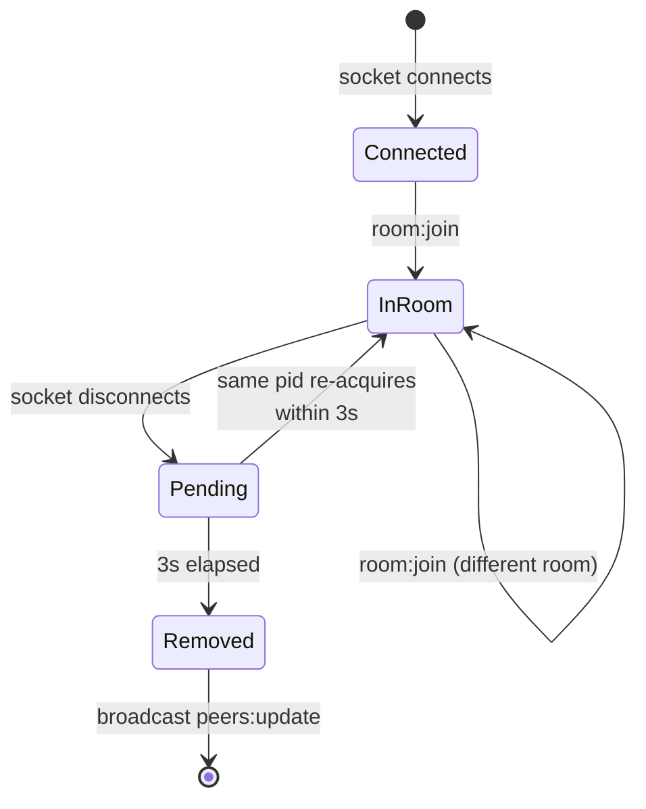

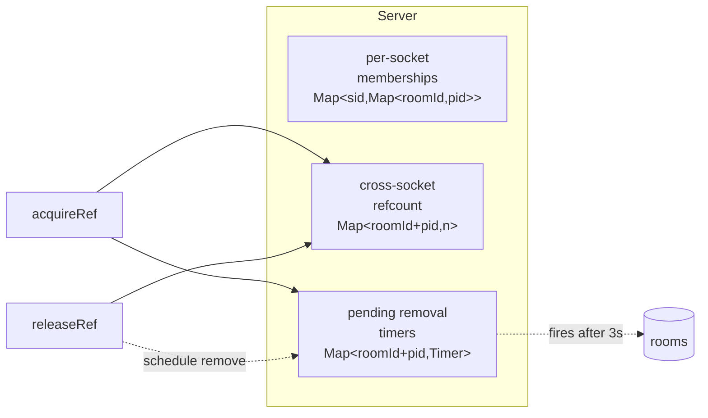

---

## 7. Real-time event matrix

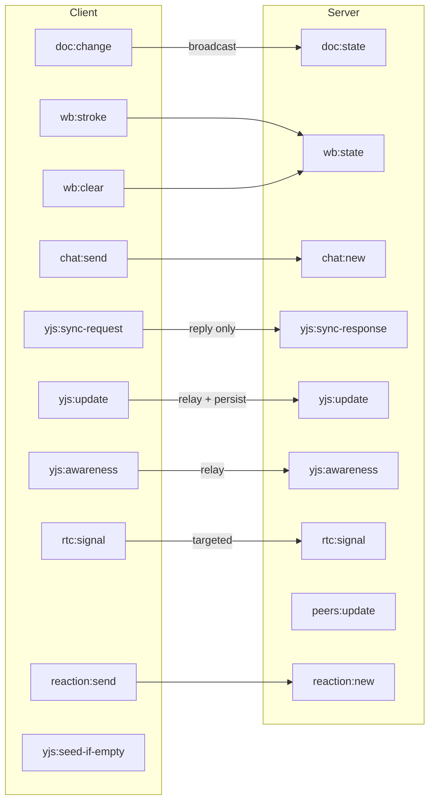

| Direction | Event | Payload (essentials) | Persisted |
|---|---|---|---|
| C → S | `room:join` | `{roomId, name, participantId}` | yes (rooms) |
| C → S | `doc:change` | `{kind, value}` (kind = code/notes/lang) | yes, debounced 300ms |
| C → S | `wb:stroke` | `Stroke` | yes |
| C → S | `chat:send` | `{text}` | yes (capped 200) |
| C → S | `yjs:update` | `Uint8Array` | yes, debounced 1.5s |
| C → S | `yjs:awareness` | `Uint8Array` | no (transient) |
| C → S | `yjs:seed-if-empty` | `{docName, textKey, text}` → ack `{seeded}` | yes (if winner) |
| C → S | `rtc:signal` | `{to, sdp\|candidate}` | no |
| S → C | `peers:update` | `Participant[]` | — |
| S → C | `room:state` | `RoomSnapshot` | — |

---

## 8. Yjs collaboration pipeline

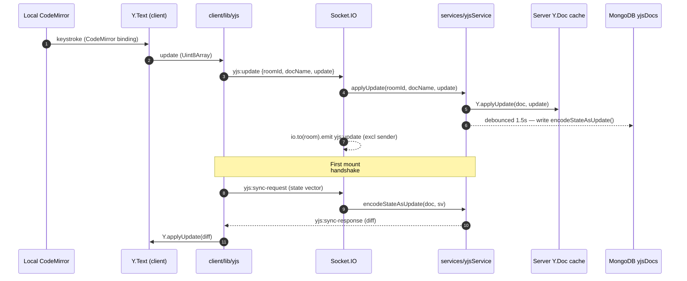

Key invariants:
- Server is **stateless from a CRDT standpoint** — it just relays + persists. All conflict resolution lives in `yjs` itself.
- Awareness (cursors) is never persisted.
- Doc cache is `Map<roomId+docName, Y.Doc>`; lazy-hydrated from Mongo on first reference.
- Per-doc cap: `MAX_DOC_BYTES = 1 MB`.
- **Initial template seeding is server-authoritative.** When a fresh room is opened, the client emits `yjs:seed-if-empty` instead of inserting locally. The server checks the in-memory `Y.Text` length atomically (Node is single-threaded), inserts the template iff empty, and broadcasts the resulting update to every peer in the room. This prevents two simultaneous fresh opens from each seeding the template and producing a duplicated buffer after CRDT merge.
- **`socket.join(roomId)` runs synchronously before any `await` in `room:join`.** socket.io does not pause event delivery while a handler is suspended on `await`, so deferring the join until after a Mongo round-trip would cause the client's immediately-following `yjs:sync-request` to be dropped (`socket.rooms.has(roomId) === false`).

---

## 9. WebRTC mesh

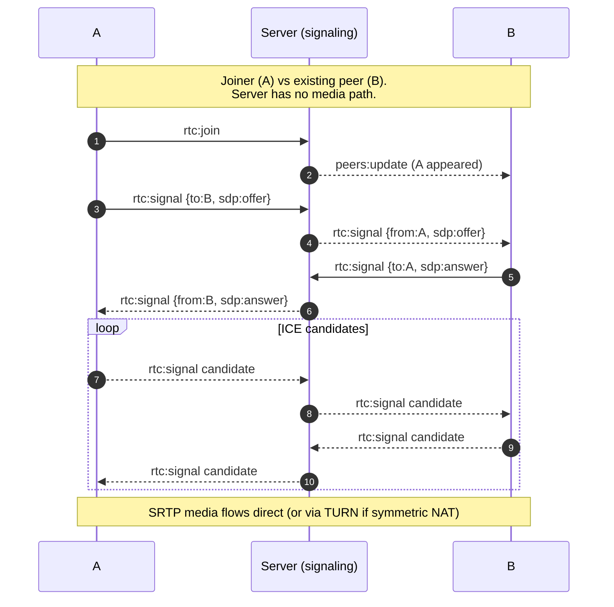

Mesh scaling:

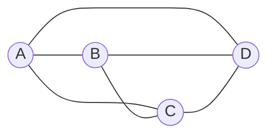

`O(n²)` peer connections. Hard cap at ~6 participants for usable mesh; beyond that an SFU is required (out of scope).

---

## 10. Whiteboard pipeline

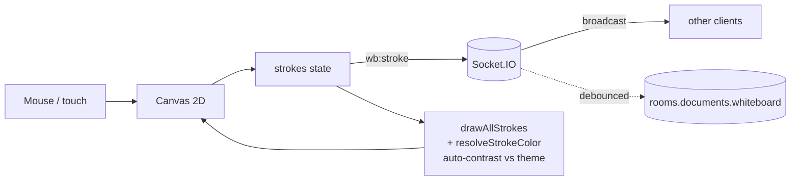

Render guarantees stroke visibility across themes:
- Pure white on light bg → re-rendered as dark ink.
- Pure black on dark bg → re-rendered as light ink.
- Strokes within ±0.15 luminance of bg → treated as eraser (drawn as bg).
- Default new ink = `#2979ff` (blue) — high contrast in both modes.

---

## 11. Code execution flow

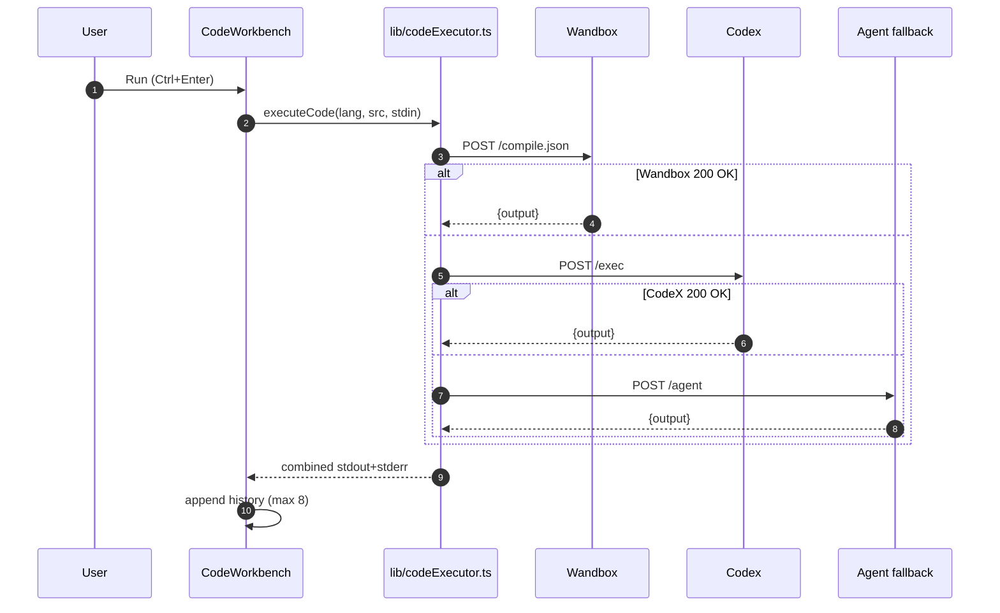

---

## 12. Data model

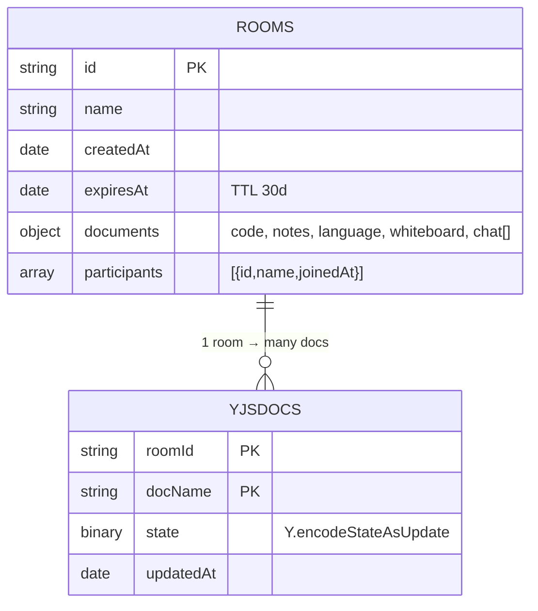

`rooms` indexes: `{id:1}` unique, `{expiresAt:1}` TTL.
`yjsDocs` indexes: `{roomId:1, docName:1}` unique, `{updatedAt:1}` TTL 30d.

---

## 13. Theming

```mermaid
flowchart LR
  OS[OS prefers-color-scheme] -. fallback .-> CMP
  LS[localStorage<br/>vaartalaap:color-mode] -. preferred .-> CMP[ColorModeProvider]
  CMP --> MUI[MUI ThemeProvider<br/>buildMuiTheme(mode)]
  CMP --> Doc[document.documentElement<br/>data-color-mode + colorScheme]
  MUI --> Comps[All MUI components]
  Doc --> Native[native scrollbars,<br/>form controls]
  CMP --> CMHook[useColorMode hook]
  CMHook --> CW[CodeWorkbench]
  CW --> CM[CodeMirror<br/>oneDark | defaultHighlightStyle]
  CMHook --> WB[Whiteboard]
  WB --> Canvas[canvas bg + auto-contrast]
```

---

## 14. Security boundary

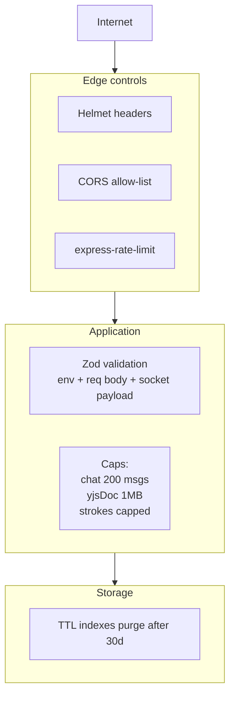

What's **not** in scope: authn/z, end-to-end encryption (WebRTC media is SRTP but server can read REST + WS payloads), abuse prevention beyond rate limits.

---

## 15. Performance budget

| Hot path | Target | Mechanism |
|---|---|---|
| Code keystroke → peer keystroke | <150 ms | Yjs update batched on next tick, WS broadcast |
| Whiteboard stroke ack | <50 ms local, <200 ms peer | Optimistic local draw + WS broadcast |
| Code → DB snapshot | 300 ms debounce | `roomService.persistDocuments` |
| Yjs → DB | 1500 ms debounce | `yjsService` per-doc timer |
| Reconnect after refresh | 3 s grace before kick | server `pendingRemovals` |
