# Vaartalaap — Deployment

Diagram-first. Free-tier compatible.

---

## 1. Production topology

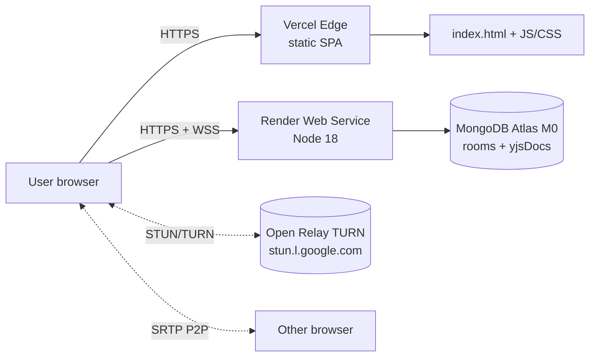

| Layer | Provider | Plan | Notes |
|---|---|---|---|
| Static SPA | Vercel | Hobby (free) | Auto SSL + global CDN |
| API + WebSocket | Render | Free Web Service | Cold-start ~30 s; upgrade to Starter to avoid |
| Database | MongoDB Atlas | M0 free | 512 MB storage, shared CPU |
| TURN | openrelay.metered.ca | Free public | Adds latency vs paid (Twilio/Xirsys) |

Alternatives: Fly.io / Railway for API; Netlify / Cloudflare Pages for SPA; self-hosted coturn for TURN.

---

## 2. Build pipeline

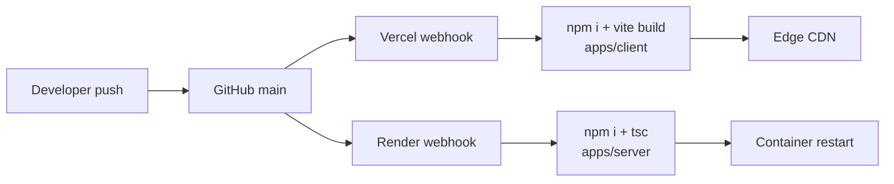

---

## 3. Required environment

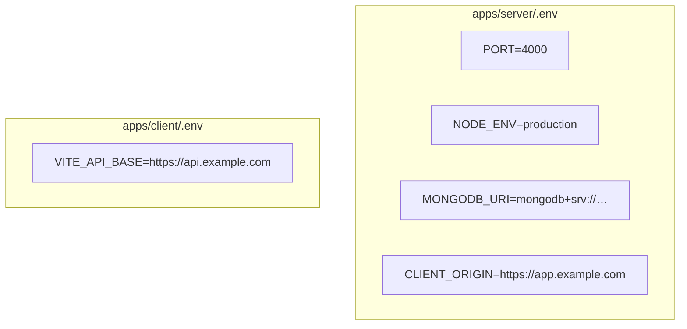

`config/env.ts` validates with Zod — server fails fast on bad input.

---

## 4. Network ports & flows

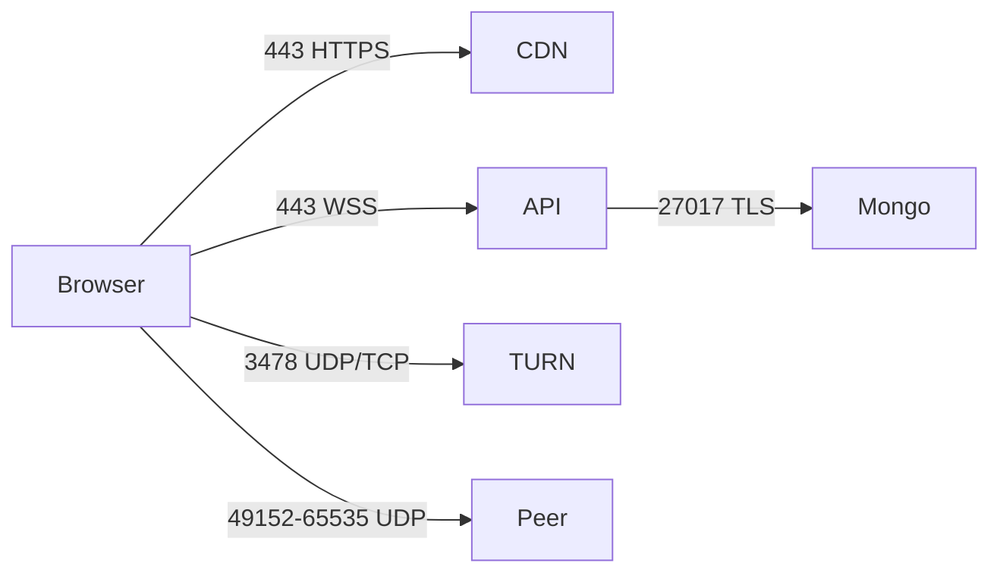

CORS allow-list (server `index.ts`):
- `CLIENT_ORIGIN` (production)
- `http://localhost:5173` (dev)

---

## 5. MongoDB Atlas setup

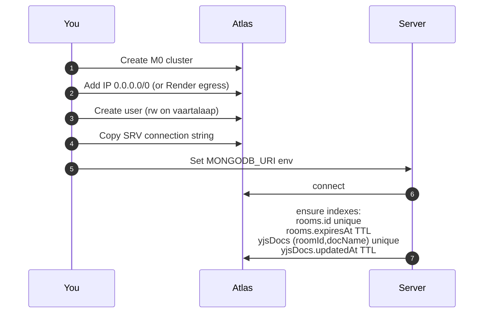

---

## 6. Render (API) deploy steps

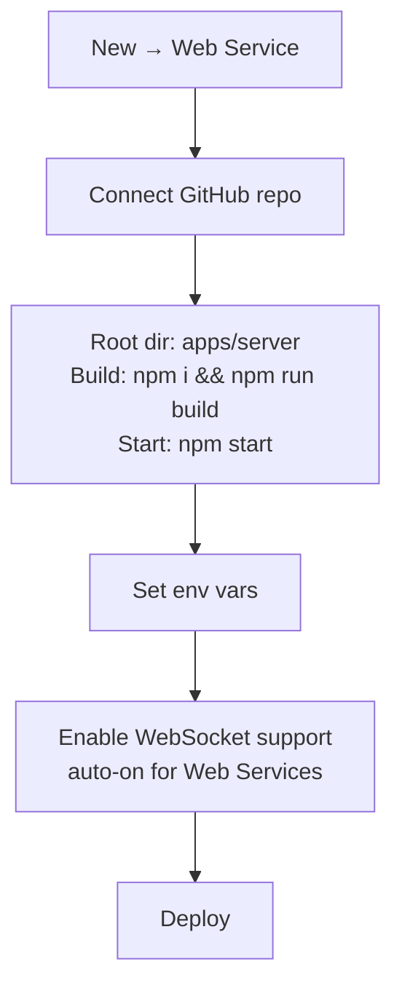

`apps/server/package.json` scripts:
- `build` → `tsc -p tsconfig.json`
- `start` → `node dist/index.js`

---

## 7. Vercel (SPA) deploy steps

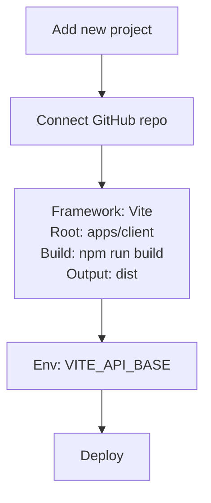

If using monorepo with `workspaces`, set `Install Command` = `cd ../.. && npm install` so the workspace `@vaartalaap/shared` resolves.

---

## 8. Health & observability

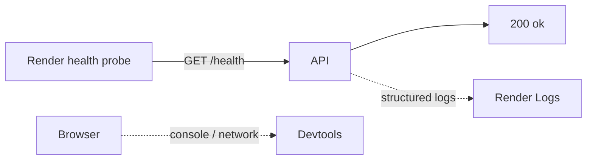

The server exposes `/health` (returns `{status:"ok"}`) used by Render's auto-restart loop.

---

## 9. Cost ceiling at zero spend

| Resource | Free quota | Practical limit |
|---|---|---|
| Vercel bandwidth | 100 GB/mo | ~50k room loads |
| Render hours | 750 h/mo | 1 always-on service |
| Atlas storage | 512 MB | ~5–10k active rooms (with TTL) |
| Open Relay TURN | unlimited | rate-limited; flaky for many concurrent calls |

Beyond this: $7/mo Render Starter (no cold start), $9/mo Atlas M2, paid TURN (~$5/mo Twilio).

---

## 10. Failure modes & fallbacks

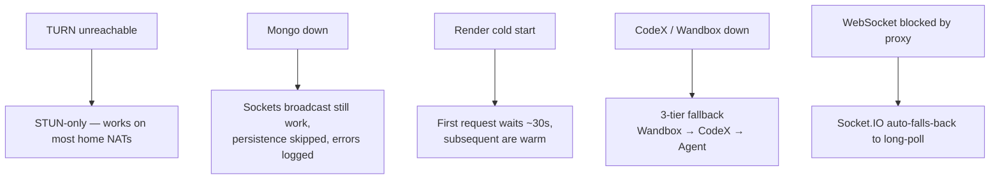

---

## 11. Update / rollback

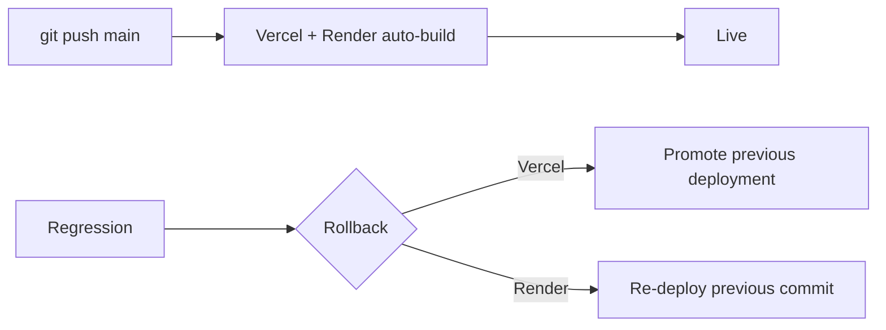

Both providers retain the last ~10 deployments; rollback is one click.

---

## 12. Local dev parity

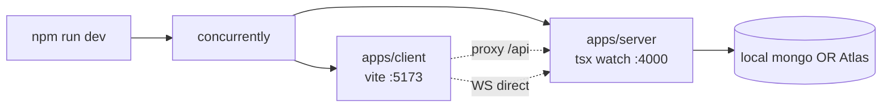

Required local env: Node 18+, optional local MongoDB (or Atlas M0 string).
